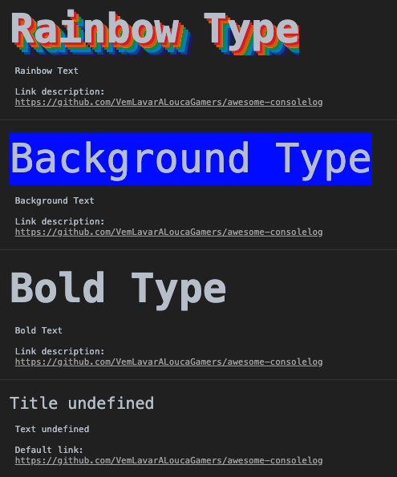

# awesome-consolelog


This package allows you to print beautiful **console.log**.

This **console.log** is used by companies that leave messages on the **console** of websites for when the user inspects a page, stating some precautions or even rewards.

## Install
```js
npm i @vemlavaraloucagamers/awesome-consolelog

yarn add @vemlavaraloucagamers/awesome-consolelog
```

## Usage
```js
const awesomeConsole = require("@vemlavaraloucagamers/awesome-consolelog");

const rainbowConfig = {
  title: "Rainbow Type",
  titleConfig: {
  	color: "#ffffff",
  	size: "50px",
  	background: "transparent",
  	shadow: [
    	"rgb(217,31,38)",
    	"rgb(226,91,14)",
    	"rgb(245,221,8)",
    	"rgb(5,148,68)",
    	"rgb(2,135,206)",
    	"rgb(4,77,145)",
    	"rgb(42,21,113)"
  	]
  },
  text: "Rainbow Text",
  hasLink: true,
  link: {
    text: "Link description",
    url: "https://github.com/VemLavarALoucaGamers/awesome-consolelog"
  }
}

awesomeConsole('rainbow', rainbowConfig)
```


## Help

The function accepts two parameters (not optional):

- The first is the message **type** (string), which can be **normal**, **bold**, **background** and **rainbow**
- The second is the message **configuration**

The configuration is an object with the following properties:

- title: The company name or a word of attention is usually defined.
- titleConfig: This property is an object with two required properties (**color** and **size**) and two optional properties (**background** and **shadow**). The **background** property is used for the **background type** and the **shadow** property is used for the **rainbow type**. The **shadow** expects to receive an array with seven colors.
- text: It is used to inform something.
- hasLink: Accepts **true** or **false**, if set to true we can set the link property.
- link: If the previous property was set to **true**, we can set this. This property is an object with two required properties, **text** and **link**. **Text** is the text that references the link.

**OBS:** The values of the properties contained in **titleConfig** are css, so it is possible to define colors and backgrounds in HEX, RGB or transparent.


```js
awesomeConsole('bold', config)
```


## Examples
